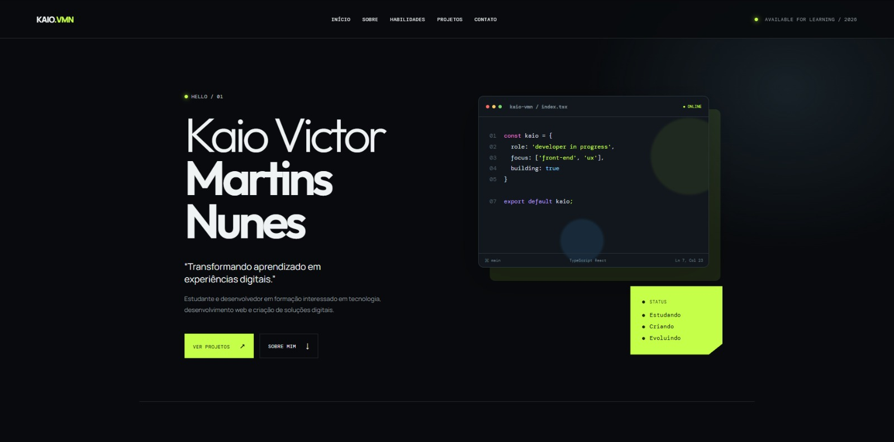
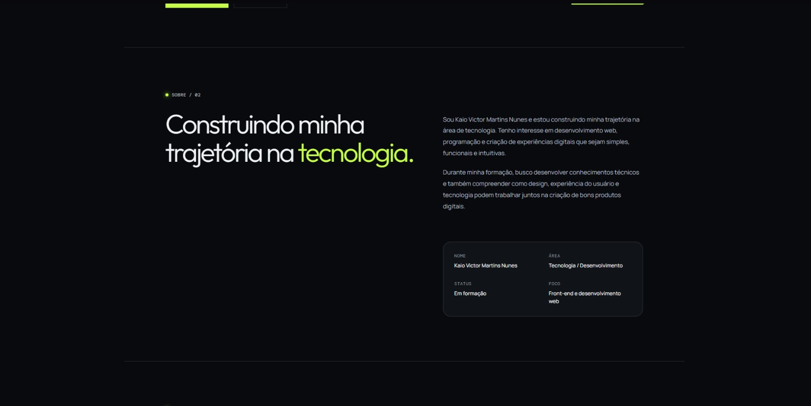
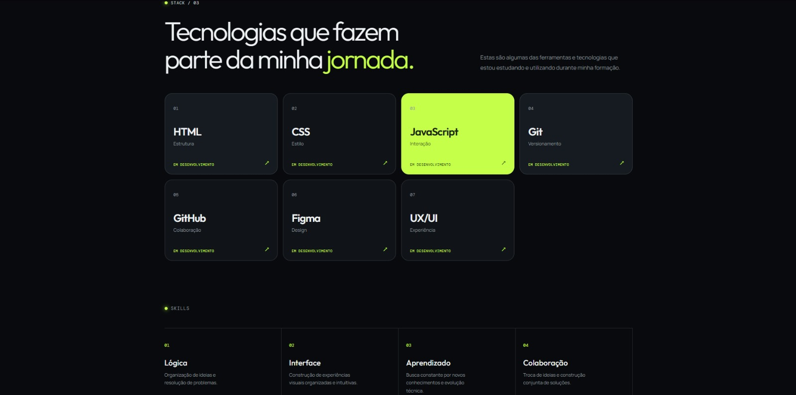
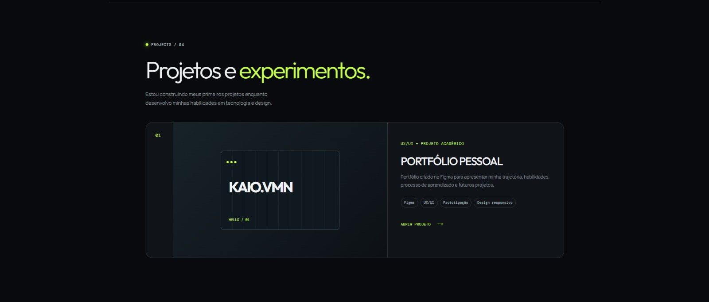
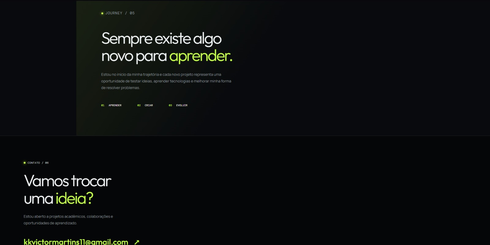

# Portfólio Pessoal — Kaio Victor Martins Nunes

Projeto acadêmico desenvolvido para a trilha **Front-end | Design de Experiência**, com foco na criação de um portfólio pessoal moderno, tecnológico e responsivo utilizando o **Figma** e o **Figma Make**.

O portfólio foi criado para apresentar minha trajetória, habilidades, processo de aprendizado e evolução na área de tecnologia de forma clara, organizada e visualmente consistente.

## Acesse o projeto

**Portfólio publicado:**  
https://donkey-meta-79832163.figma.site/#inicio

## Sobre o projeto

Este portfólio representa meu momento atual de formação na área de tecnologia.

Como estou construindo meus primeiros projetos, utilizei o próprio desenvolvimento deste portfólio como meu primeiro **projeto acadêmico**, apresentando minha trajetória, conhecimentos em desenvolvimento, habilidades e processo de evolução.

A proposta foi criar uma identidade visual própria, com linguagem tecnológica e contemporânea, diferente de um portfólio editorial tradicional.

## Objetivo

O objetivo do projeto foi desenvolver um portfólio capaz de:

- apresentar minha trajetória;
- destacar as tecnologias que estou estudando;
- organizar minhas habilidades;
- reunir projetos e experimentos;
- demonstrar meu processo de aprendizado;
- facilitar o contato profissional;
- evoluir futuramente com novos projetos e experiências.

## Identidade visual

O projeto utiliza uma estética tecnológica e minimalista, baseada em:

- fundo escuro;
- tons de grafite e preto;
- verde-limão como cor de destaque;
- tipografia sans-serif moderna;
- pequenos textos em fonte monoespaçada;
- cards modulares;
- grid organizado;
- bordas discretas;
- elementos inspirados em interfaces de programação;
- pequenas interações visuais.

A proposta visual busca transmitir **tecnologia, organização, criatividade, aprendizado e evolução**.

## Sobre mim

Sou **Kaio Victor Martins Nunes** e estou construindo minha trajetória na área de tecnologia.

Tenho interesse em desenvolvimento web, programação e criação de experiências digitais simples, funcionais e intuitivas.

Durante minha formação, busco desenvolver conhecimentos técnicos e compreender como design, experiência do usuário e tecnologia podem trabalhar juntos na construção de boas soluções digitais.

## Tecnologias e habilidades

O portfólio apresenta algumas das tecnologias e ferramentas que fazem parte da minha jornada de aprendizado:

- HTML
- CSS
- JavaScript
- Git
- GitHub
- Figma
- UX/UI

Também são destacadas habilidades como:

- lógica;
- construção de interfaces;
- aprendizado contínuo;
- colaboração;
- organização de ideias;
- resolução de problemas.

## Projeto em destaque

### Portfólio Pessoal

**Categoria:** UX/UI · Projeto acadêmico

O projeto em destaque é o próprio portfólio pessoal, criado no Figma para apresentar minha trajetória, habilidades, processo de aprendizado e futuros projetos.

Foram utilizados conceitos de:

- Figma;
- UX/UI;
- prototipação;
- design responsivo;
- organização de conteúdo;
- hierarquia visual.

## Processo de criação

O desenvolvimento do portfólio foi organizado em etapas:

### 1. Pesquisa

Busca por referências visuais e compreensão da proposta da atividade.

### 2. Estrutura

Organização das informações e definição das principais seções do portfólio.

### 3. Design

Construção da identidade visual, escolha das cores, tipografia, composição e criação dos componentes.

### 4. Prototipação

Criação das telas, navegação e ajustes da experiência do usuário.

## Jornada de aprendizado

O portfólio também apresenta uma seção dedicada à evolução pessoal e profissional.

A proposta dessa área é representar três ideias principais:

- **Aprender**
- **Criar**
- **Evoluir**

Cada novo projeto representa uma oportunidade de testar ideias, desenvolver habilidades e melhorar minha forma de resolver problemas.

## Telas do projeto

### Página inicial

A página inicial apresenta meu nome, uma breve descrição e a proposta do portfólio.



### Sobre mim

Seção dedicada à minha apresentação, trajetória e interesses na área de tecnologia.



### Tecnologias e habilidades

Área que apresenta as tecnologias que fazem parte da minha jornada de aprendizado e habilidades que estou desenvolvendo.



### Projetos e experimentos

Seção destinada aos projetos desenvolvidos durante minha formação, tendo o próprio portfólio como primeiro projeto acadêmico.



### Jornada e contato

Seção final dedicada à evolução, aprendizado e formas de contato.



## Estrutura do repositório

```text
portfolio-kaio/
├── README.md
└── images/
    ├── home.jpeg
    ├── sobre.jpeg
    ├── habilidades.jpeg
    ├── projetos.jpeg
    └── jornada-contato.jpeg
```

## Contato

**Kaio Victor Martins Nunes**

E-mail: [kkvictormartins11@gmail.com](mailto:kkvictormartins11@gmail.com)

---

Desenvolvido por **Kaio Victor Martins Nunes** — 2026.
